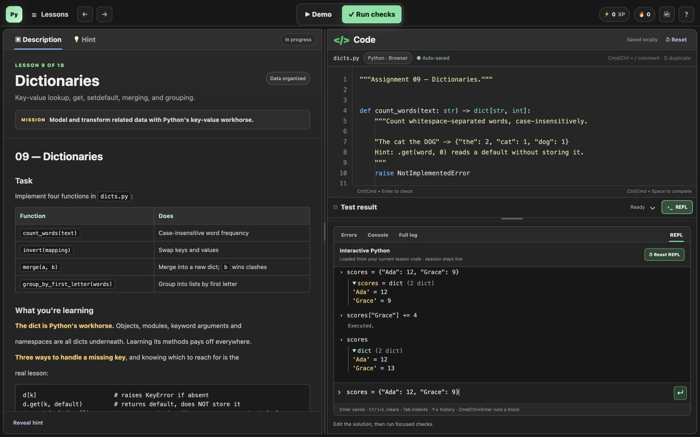

# Pyquest

A browser-based Python practice workspace for Alex's
[Python: Zero to Hero](https://github.com/Alendro305/python-learning) course.
Read a lesson, edit the starter, run its checks, and experiment in a persistent
REPL without leaving the page.

[](LICENSE)
[](https://github.com/seanbud/pyquest/actions/workflows/ci.yml)
[](https://github.com/seanbud/pyquest/actions/workflows/pages.yml)

### **[Open Pyquest](https://seanbud.github.io/pyquest/)** 
[Roadmap](ROADMAP.md) · [Course format](docs/COURSE_FORMAT.md)

## Screenshot



## Included

- Resizable lesson, editor, and results panes
- Rendered Markdown instructions and focused checks
- Python highlighting, line numbers, indentation guides, whitespace markers,
  and editor shortcuts
- Clickable test results that jump to highlighted source lines, with captured
  output and readable tracebacks
- Stateful REPL with command history and expandable Python values
- Local drafts, progress, XP, optional sound, and reduced-motion support
- Browser execution with Pyodide; native execution with CPython and pytest

## Course coverage

Pyquest currently supports **18 of Alex's 50 lessons**.

### Available now — lessons 1–18

| Lessons | Topics |
| --- | --- |
| 1–6 · Fundamentals | Variables, types, f-strings; numbers and operators; strings and slicing; conditionals and truthiness; loops, `range`, and `enumerate`; functions, defaults, `*args`, and `**kwargs` |
| 7–12 · Collections | Lists; tuples and unpacking; dictionaries; sets; comprehensions; sorting with keys |
| 13–18 · Functions in depth | Scope, closures, and LEGB; first-class functions and `lambda`; decorators; decorator arguments and `functools.wraps`; `partial`, `reduce`, and `lru_cache`; type hints and `typing` |

### Not yet available — lessons 19–50

These assignments exist in Alex's course but have not yet been integrated into
Pyquest.

| Lessons | Topics |
| --- | --- |
| 19–25 · Objects and the data model | Classes; dunder methods; properties and encapsulation; inheritance and `super()`; dataclasses; operator overloading and ordering; protocols, ABCs, and duck typing |
| 26–31 · Iteration, errors, and context | Iterator protocol; generators and `yield`; `itertools`; exceptions and custom errors; context managers and `contextlib`; modules, packages, and imports |
| 32–37 · Data and parsing | Files and `pathlib`; parsing records; regular expressions; CSV and tabular data; JSON; dates and times |
| 38–41 · Concurrency | Threads and shared state; `concurrent.futures`; multiprocessing; `async`, `await`, and `asyncio` |
| 42–45 · Web, databases, and testing | HTTP clients; building an HTTP service; SQLite and SQL; pytest fixtures, parametrization, and mocking |
| 46–50 · Automation and capstone | CLI tools with `argparse`; `subprocess`; filesystem automation; logging and configuration; multi-source automation pipeline capstone |

## Use the browser app

Open **[seanbud.github.io/pyquest](https://seanbud.github.io/pyquest/)** and
choose a lesson. The first execution downloads Pyodide; learner code then runs
in the browser.

Browser mode supports the patterns used by lessons 1–18: plain `test_*`
functions, assertions, and `pytest.raises`. Use native mode for full pytest,
native packages, or offline work after setup.

## Run locally

Requirements: Python 3.11+ (3.13 recommended) and
[uv](https://docs.astral.sh/uv/).

```bash
git clone https://github.com/seanbud/pyquest.git
cd pyquest
git clone https://github.com/Alendro305/python-learning.git course
uv venv --python 3.13
uv pip install pytest
.venv/bin/python server.py --port 8765
```

Open [http://127.0.0.1:8765](http://127.0.0.1:8765). To reuse an existing
course checkout, set `PYQUEST_COURSE_ROOT=/path/to/python-learning`.

The local runner executes code on your machine. It is not a hardened sandbox;
keep it bound to localhost. See [SECURITY.md](SECURITY.md).

## Shortcuts

| Shortcut | Action |
| --- | --- |
| `Ctrl/Cmd + Enter` | Run focused checks |
| `Ctrl/Cmd + /` | Toggle line comments |
| `Tab` / `Shift + Tab` | Indent or outdent |
| `Ctrl/Cmd + Space` | Show completions |
| `↑` / `↓` | Navigate REPL history |
| `Ctrl + L` | Clear the REPL transcript |

## Add another course

Pyquest keeps its interface separate from course content. A versioned
`course.json` points to lesson files, tests, and demos in another repository.
See the [manifest format](docs/COURSE_FORMAT.md) and
[architecture](docs/ARCHITECTURE.md).

Multi-file workspaces and project pipelines are planned in the
[roadmap](ROADMAP.md).

## Attribution and license

The Pyquest interface and runtime use the [MIT License](LICENSE). Course
instructions, starters, tests, and demos belong to
[Alendro305/python-learning](https://github.com/Alendro305/python-learning).
They are fetched from the original repository and are not distributed or
relicensed by Pyquest. See [NOTICE.md](NOTICE.md).
